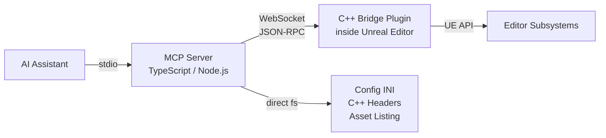

# UE-MCP

**Unreal Engine Model Context Protocol Server** — gives AI assistants deep read/write access to the Unreal Editor through 18 category tools covering 260+ actions.

A TypeScript MCP server connects to a C++ WebSocket bridge plugin running inside the editor. Full read/write access with undo, compilation, runtime reflection, PIE introspection, and build pipeline control. Filesystem-based operations (config INI, C++ headers, asset listing) work without the editor.

## What Can It Do?

| Category | Examples |
|----------|----------|
| **Levels** | Place/move/delete actors, spawn lights and volumes, manage splines |
| **Blueprints** | Read/write graphs, add nodes, connect pins, compile |
| **Materials** | Create materials and instances, author expression graphs, set parameters |
| **Assets** | CRUD, import meshes/textures/animations, datatables |
| **Animation** | Read/create anim blueprints, montages, blendspaces, skeletons |
| **VFX** | Create and configure Niagara systems and emitters |
| **Landscape** | Sculpt terrain, paint layers, import heightmaps |
| **PCG** | Author and execute Procedural Content Generation graphs |
| **Gameplay** | Physics, collision, navigation, AI (behavior trees, EQS, perception), input |
| **GAS** | Gameplay Ability System — attributes, abilities, effects, cues |
| **Networking** | Replication, dormancy, relevancy, net priority |
| **UI** | UMG widget trees, editor utility widgets and blueprints |
| **Editor** | Console commands, Python escape hatch, PIE, viewport, sequencer, build pipeline, logs |
| **Reflection** | Class/struct/enum introspection, gameplay tags |

## Getting Started

See **[Getting Started](getting-started.md)** for installation and setup.

## Navigation

- **[Getting Started](getting-started.md)** — Install, configure, verify
- **[Architecture](architecture.md)** — How the pieces fit together
- **[Tool Reference](tool-reference.md)** — All 18 tools with every action
- **[Configuration](configuration.md)** — `.ue-mcp.json` and MCP client config
- **[Neon Shrine Demo](neon-shrine-demo.md)** — Interactive demo walkthrough
- **[Troubleshooting](troubleshooting.md)** — Common issues and fixes
- **[Development](development.md)** — Building from source, testing, contributing
